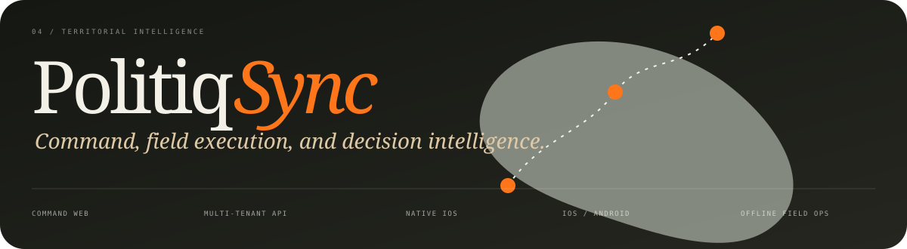

  

  
  
  
  

## Software Architect · Product Originator · Principal Engineer

I conceive, architect, and ship ambitious software from first principles to production. My work
spans **autonomous AI, distributed platforms, real-time infrastructure, cloud systems, native
applications, edge computing, computer vision, and software that reaches into the physical
world**.

I do not limit my responsibility to diagrams or technical direction. I define the product,
establish the architecture, implement critical paths, design the operating model, and remain
accountable for delivery, observability, resilience, and the final experience.

> **14 systems and products · 26 audited codebases · 234 technologies in practice · end-to-end ownership**

### Where I create leverage

| Product direction | System architecture | Critical engineering | Production ownership |
| :--- | :--- | :--- | :--- |
| I turn ambiguous opportunities into coherent products and operating models. | I make consequential decisions across interfaces, services, data, cloud, security, and physical infrastructure. | I prototype the hardest integrations, establish implementation standards, and solve the highest-risk paths. | I design telemetry, controlled delivery, resilience, and recovery into every platform. |

## Defining systems

### 01 — AgentOS

I designed the governance layer that turns autonomous agents into accountable production
infrastructure. The system separates the control plane from the execution plane, coordinates
durable workloads across **web, Tauri desktop, and native iOS**, and places execution behind
explicit policies, approvals, audit trails, isolated sandboxes, and observable runtime state.

`LangGraph` · `MCP` · `FastAPI` · `PostgreSQL` · `OpenTelemetry` · `Tauri / Rust` · `SwiftUI`

### 02 — OmniCube

I built the nervous system that turns raw vehicle telemetry into decisions while the fleet is
still moving. OmniCube ingests heterogeneous GPS traffic over **TCP and UDP**, decodes multiple
protocols, streams events through **Kafka**, distributes priority updates through WebSockets,
and unifies maps, history, routes, alerts, reports, and operational control.

`React 19` · `TypeScript` · `Kafka` · `FastAPI` · `PostgreSQL` · `Mapbox` · `AWS ECS` · `Cloudflare Workers`

### 03 — Neurocity

I created a city-scale command layer where video, telemetry, alarms, and edge infrastructure
become one operating picture. It coordinates gateways, cameras, GPS devices, intercoms, and
alarm panels through real-time media, secure connectivity, device discovery, time-series data,
and geographically distributed infrastructure.

`React 19` · `FastAPI` · `TimescaleDB` · `Redis` · `WebRTC` · `RTSP` · `Prometheus` · `WireGuard`

### 04 — PolitiqSync

I conceived PolitiqSync as one territorial intelligence loop across four coordinated products:
a **React command centre**, a secure **FastAPI multi-tenant platform**, a native **SwiftUI field
client**, and an **Expo / React Native application** for iOS and Android. The ecosystem connects
territories, teams, dynamic surveys, evidence, attendance, offline capture, NFC, QR, analytics,
background location, and live operations.

`React 19` · `TypeScript` · `FastAPI` · `PostgreSQL` · `SwiftUI` · `Core NFC` · `React Native` · `Expo` · `Mapbox`

## Architecture practice

<table>
  <tr>
    <td width="50%" valign="top">
      <h3>Autonomous & agentic AI</h3>
      
Governed graph execution, MCP integrations, model routing, durable checkpoints, human approval gates, isolated execution, retrieval, and realtime multimodal clients.

      
<code>LangGraph</code> <code>LangChain</code> <code>MCP</code> <code>OpenAI</code> <code>Anthropic</code> <code>Gemini</code> <code>Ollama</code>

    </td>
    <td width="50%" valign="top">
      <h3>Distributed & real-time systems</h3>
      
Event ingestion, durable streams, device protocols, low-latency fan-out, live media, asynchronous workers, and operational control.

      
<code>Kafka</code> <code>Redis Streams</code> <code>WebSockets</code> <code>WebRTC</code> <code>TCP / UDP</code> <code>RTSP</code>

    </td>
  </tr>
  <tr>
    <td width="50%" valign="top">
      <h3>Cloud & platform engineering</h3>
      
Container delivery, private data, secrets, identity, edge execution, observability, DNS, Linux services, verification, and recovery.

      
<code>AWS ECS</code> <code>Fargate</code> <code>RDS</code> <code>S3 / KMS</code> <code>Cloudflare Workers</code> <code>Docker</code>

    </td>
    <td width="50%" valign="top">
      <h3>Edge, vision & physical systems</h3>
      
Local inference, biometric retrieval, embedded control, resilient gateways, camera systems, and deterministic physical-world automation.

      
<code>C / C++</code> <code>OpenCV</code> <code>ONNX</code> <code>TFLite</code> <code>Raspberry Pi</code> <code>ESP32</code> <code>IMX500</code>

    </td>
  </tr>
</table>

## Languages & principal stack

| I program in | I build product surfaces with | I build platforms with | I operate systems with |
| :--- | :--- | :--- | :--- |
| **Python** · **TypeScript** · **JavaScript** · **C** · **C++** · **Swift** · **Rust** · **SQL** · **Bash** | React 19 · Next.js · React Native · Expo · SwiftUI · Tauri · Tailwind CSS · Three.js | FastAPI · SQLAlchemy · PostgreSQL · TimescaleDB · Redis · Kafka · REST · WebSockets · MCP | AWS · Cloudflare · Docker · OpenTelemetry · Prometheus · Grafana · Loki · Tempo · Sentry · Linux |

  
<strong>Complete capability index</strong>

   

  **AI & perception** — LangGraph, LangChain, OpenAI Agents SDK, OpenAI Realtime API,
  Anthropic, Gemini, Ollama, FAISS, InsightFace, ArcFace, ONNX Runtime, TensorFlow Lite,
  Ultralytics YOLO, OpenCV, NumPy, Pandas.

  **Data & geospatial** — PostgreSQL, TimescaleDB, PostGIS, Redis, Redis Streams, MinIO,
  S3, SQLAlchemy, Alembic, Mapbox GL, MapLibre, Leaflet, GeoJSON, Shapely, geofencing,
  route reconstruction.

  **Native & device capabilities** — SwiftUI, UIKit, CoreLocation, Core NFC, AVFoundation,
  WatchKit, Keychain, React Native, Expo Camera, background location, secure storage,
  Tauri 2, Tokio, native keyrings.

  **Delivery & reliability** — ECS, Fargate, ECR, RDS, S3, KMS, Secrets Manager,
  CloudWatch, Route 53, Cloudflare Workers, Wrangler, Docker, systemd, OpenTelemetry,
  Prometheus, Grafana, Loki, Tempo, Sentry, k6.

## Beyond the flagships

My broader body of work spans **local-first agents, energy optimization, intelligent crossings,
biometric identity, vector retrieval, healthcare operations, institutional case management,
computer vision, embedded access control, and complex product workflows**.

Representative systems include TARS, OptiCore, Intelligent Crossing, ZPass, Identity Analyzer,
FaceID Service, SIAI, Martial, Vicefiscalía, and MedAdvisor. Their repositories remain private;
the architecture and implemented capabilities are reflected here without exposing internal code.

## The roles where I create the most leverage

- **Principal Software Architect**
- **Staff / Principal Engineer**
- **AI Platform Architect**
- **Founding Engineer**

  

  <a href="mailto:ahban@outlook.com?subject=Software%20Architecture%20Opportunity"><strong>ahban@outlook.com</strong></a>
  &nbsp;·&nbsp;
  Mexico / Available globally
  &nbsp;·&nbsp;
  <a href="https://github.com/AhbanL">github.com/AhbanL</a>

