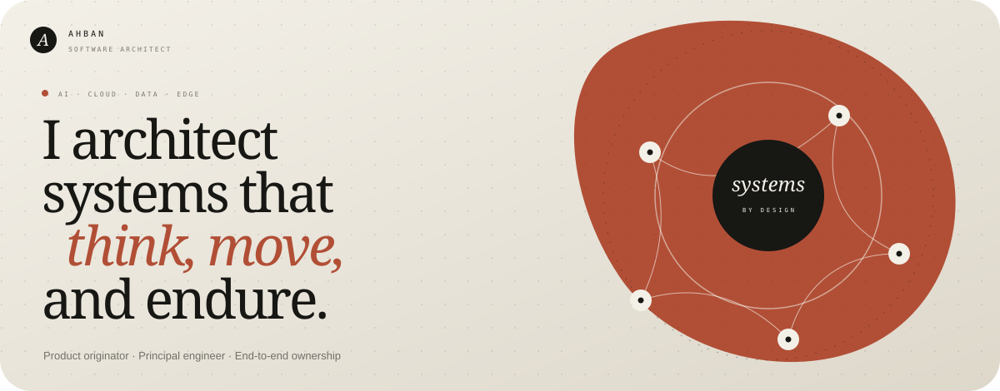
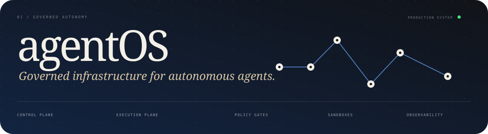
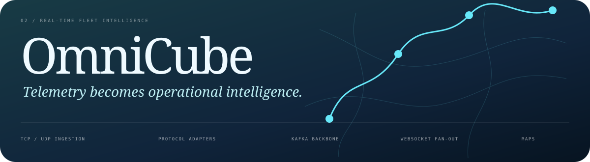
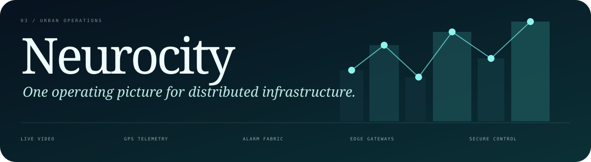
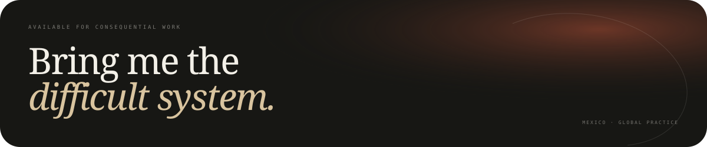

  

  
  
  
  

## Software Architect · Product Originator · Principal Engineer

I originate, architect, and ship ambitious products from first principles to production. I work
across **autonomous AI, distributed and real-time platforms, cloud infrastructure, native
applications, computer vision, and edge systems**—defining the product, implementing critical
paths, and owning reliability through delivery.

> **14 systems and products · 26 codebases · Web, native, cloud, and edge · End-to-end ownership**

## Selected production systems

<table>
  <tr>
    <td width="33.33%" valign="top">
      
      <h3><a href="https://agentos.mx/dashboard">AgentOS ↗</a></h3>
      
<strong>Governed autonomous AI.</strong> I designed its control and execution planes, policy gates, approvals, sandboxes, auditability, and multi-client runtime.

      
<code>LangGraph</code> <code>MCP</code> <code>FastAPI</code> <code>PostgreSQL</code> <code>Tauri</code> <code>SwiftUI</code>

    </td>
    <td width="33.33%" valign="top">
      
      <h3><a href="https://omnicube.mx">OmniCube ↗</a></h3>
      
<strong>Real-time fleet intelligence.</strong> I architected TCP/UDP protocol ingestion, Kafka event processing, WebSocket fan-out, and live operational control.

      
<code>React</code> <code>TypeScript</code> <code>Kafka</code> <code>FastAPI</code> <code>PostgreSQL</code> <code>AWS</code>

    </td>
    <td width="33.33%" valign="top">
      
      <h3><a href="https://neurocity-frontend.orange-hill-1d01.workers.dev/login">Neurocity ↗</a></h3>
      
<strong>City-scale operational intelligence.</strong> I unified live video, telemetry, alarms, and edge gateways into one secure, observable command platform.

      
<code>React</code> <code>FastAPI</code> <code>TimescaleDB</code> <code>WebRTC</code> <code>RTSP</code> <code>WireGuard</code>

    </td>
  </tr>
</table>

## Technical range

| Discipline | Production toolkit |
| :--- | :--- |
| **Languages** | Python · TypeScript · JavaScript · C · C++ · Swift · Rust · SQL · Bash |
| **AI & agents** | LangGraph · LangChain · MCP · OpenAI · Anthropic · Gemini · Ollama · vector retrieval |
| **Product engineering** | React 19 · Next.js · React Native · Expo · SwiftUI · Tauri · Tailwind CSS · Three.js |
| **Platforms & data** | FastAPI · SQLAlchemy · PostgreSQL · TimescaleDB · PostGIS · Redis · Kafka · REST · WebSockets |
| **Cloud & reliability** | AWS · Cloudflare · Docker · Linux · OpenTelemetry · Prometheus · Grafana · Loki · Tempo · Sentry |
| **Edge & perception** | TCP/UDP · WebRTC · RTSP · OpenCV · ONNX · TensorFlow Lite · Raspberry Pi · ESP32 · IMX500 |

  
<strong>Complete engineering scope</strong>

   

  **AI and perception** — OpenAI Agents SDK, OpenAI Realtime API, FAISS, InsightFace,
  ArcFace, ONNX Runtime, Ultralytics YOLO, NumPy, and Pandas.

  **Data and geospatial** — Redis Streams, MinIO, S3, Alembic, Mapbox GL, MapLibre,
  Leaflet, GeoJSON, Shapely, geofencing, and route reconstruction.

  **Native and device capabilities** — UIKit, CoreLocation, Core NFC, AVFoundation,
  WatchKit, Keychain, Expo Camera, background location, secure storage, Tokio, and
  native keyrings.

  **Delivery and security** — ECS, Fargate, ECR, RDS, KMS, Secrets Manager,
  CloudWatch, Route 53, Cloudflare Workers, Wrangler, systemd, and k6.

  **Additional domains** — Local-first agents, energy optimization, intelligent
  crossings, biometric identity, healthcare operations, institutional case management,
  embedded access control, and complex product workflows.

  

  <strong>Principal Software Architect · Staff / Principal Engineer · AI Platform Architect · Founding Engineer</strong>
    
  <a href="https://portafolio.ahban.workers.dev"><strong>Full portfolio</strong></a>
  &nbsp;·&nbsp;
  <a href="mailto:ahban@outlook.com?subject=Software%20Architecture%20Opportunity"><strong>ahban@outlook.com</strong></a>
  &nbsp;·&nbsp;
  Mexico / Available globally
  &nbsp;·&nbsp;
  <a href="https://github.com/AhbanL">github.com/AhbanL</a>

